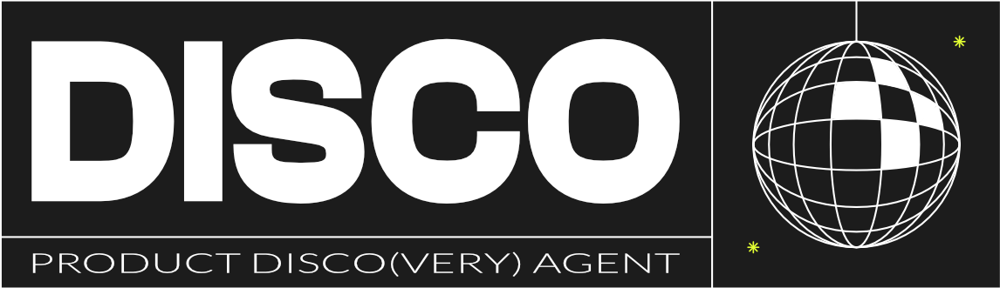

<p align="center">
  <picture>
    <source media="(prefers-color-scheme: dark)" srcset="logo/agent-disco.png">
    <source media="(prefers-color-scheme: light)" srcset="logo/agent-disco-dark.png">
    
  </picture>
</p>

# Agent Disco

Structured product discovery and specification skill for AI-assisted delivery teams.

Agent Disco turns ambiguous feature ideas into agent-consumable artifacts and a
TDD-first specification. The default persona is:

- **Disco** — Senior Product Manager (leads discovery)

A second persona is available on demand:

- **Barry** — Senior Business Analyst (sharpens requirements, business rules, data model, and Component Reuse Audit) — activated when the user says "Activate Barry"

The output is a durable folder of Markdown that works for product, engineering, QA, and coding agents simultaneously.

## What's In Here

| Path | Purpose |
|------|---------|
| `SKILL.md` | The skill itself — process flow, persona logic, intake, readiness gate, audit loop |
| `templates/product-context.md` | Product/domain grounding template |
| `templates/product-features.md` | Existing capability inventory template |
| `templates/readme-template.md` | Feature `README.md` template |
| `templates/discovery-file-template.md` | Per-area discovery file template |
| `templates/personas-template.md` | `discovery/00-personas.md` template |
| `templates/spec-template.md` | Implementation-ready spec with TDD-first agent handoff |
| `templates/adr-template.md` | Architecture/product decision record |
| `templates/audit-template.md` | Audit entry + audit index format |
| `templates/dashboard-guide.md` | Generic single-file dashboard pattern |
| `activation/claude-code/load-disco.md` | Claude Code activation entrypoint (loads Disco only) |
| `activation/claude-code/activate-barry.md` | On-demand Barry activation |
| `activation/claude-code/barry-persona.md` | Full Barry persona definition |
| `logo/agent-disco.png` | Project logo, light-on-dark variant (used in dark themes) |
| `logo/agent-disco-dark.png` | Project logo, dark-on-light variant (used in light themes) |

## Quick Start

1. Copy this repository into your project (or vendor it under `tools/agent-disco/`).
2. Fill in:
   - `templates/product-context.md`
   - `templates/product-features.md`
3. Load `SKILL.md` in your coding agent.
4. Start with: "Load Disco. I want to scope a new feature."

## Discovery Output Structure

The skill scaffolds a feature folder like this:

```text
requirements/<FeatureName>/
├── README.md
├── dashboard.html
├── discovery/
│   ├── 00-personas.md
│   ├── 01-<core-flow>.md
│   ├── 02-<area>.md
│   └── NN-<area>.md
├── specs/
│   └── SPEC-001.md
├── decisions/
│   └── ADR-001.md
└── audit/
    └── README.md
```

## Core Concepts

- **Guided Intake** — read → synthesize → challenge → confirm before scaffolding
- **Cheap Answer Detection** — refuse vague inputs ("users", "intuitive", "ASAP")
- **Assumed Content Tagging** — `⚠️ Assumed` until validated
- **OQ Namespacing** — short prefixes (e.g., `TF-01`, `GEO-03`) so questions are addressable across PR descriptions, commits, and chats
- **TDD-First Agent Handoff** — failing tests written before implementation, generated from a Test Generation Brief
- **Readiness Gate** — agent-consumability checklist before any code is written
- **Engineering Audit Loop** — capture corrections during implementation, classify (Wrong / Gap / Override), feed back into skill improvement
- **Adjacent Code Health** — surface pre-existing fragilities in code that runs alongside the new feature
- **Component Reuse Audit** — Figma-to-Component Map, Design System Deviations, and Missing States before any new component is built
- **State Combination Matrix and Branch Enumeration** — kill ambiguous boolean logic and missing early-return paths before they become bugs

## Optional Integrations

- **[Graphify](https://github.com/safishamsi/graphify)** — Build a codebase
  knowledge graph and ground Step 6 (Ground in Code) on it. See
  `docs/integrations/graphify.md`. Optional; the skill works without it.

## License

MIT — see `LICENSE`.

## Contributing

See `CONTRIBUTING.md`.
