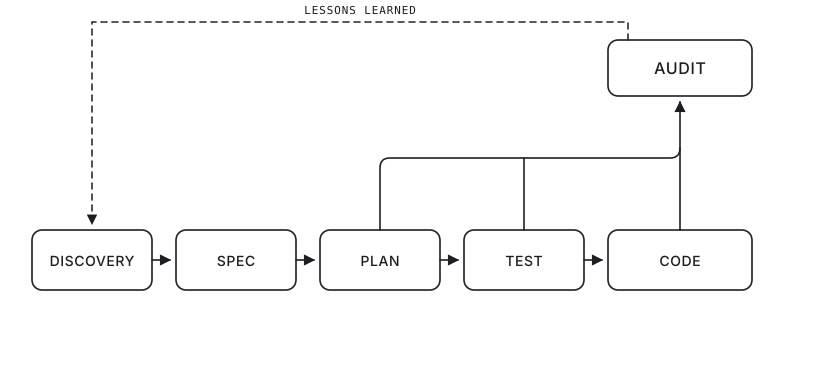
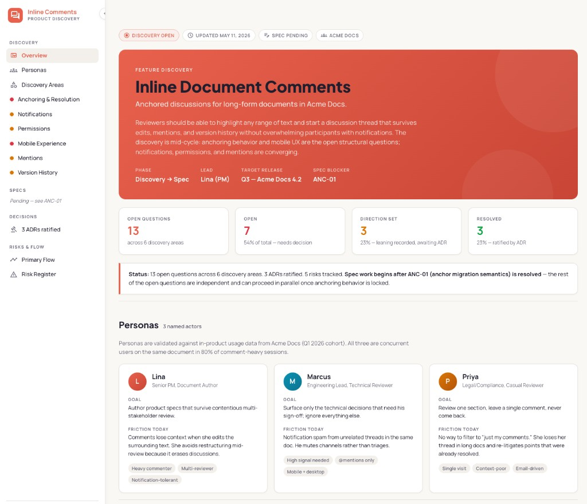

<p align="center">
  <picture>
    <source media="(prefers-color-scheme: dark)" srcset="logo/agent-disco.svg">
    <source media="(prefers-color-scheme: light)" srcset="logo/agent-disco-light.svg">
    
  </picture>
</p>

# Agent Disco

> Structured product discovery for AI-native delivery teams.

Agent Disco turns ambiguous feature ideas into specs your AI coding agent can ship from. The output is a durable folder of Markdown that PM, Engineering, QA, and the implementing agent all consume from the same source of truth.

**The problem.** Adding a feature to a large existing codebase is hard, and the hard part is rarely the writing — it's the *context*. An implementing agent landing in a 500k-line monorepo needs to know which 30 files matter, what types they expose, what patterns to follow, and what the team already decided. Without that, agents hallucinate types, pick wrong abstractions, break adjacent code, and rebuild components that already exist. Dumping the whole repo into context is expensive and noisy; agentic search is unreliable and leaves no durable record.

**The answer.** **Semantic maps** — a small set of Markdown artifacts that distill the relevant context once, at known paths, instead of re-discovering it every session.

## Quick Start

1. Copy this repository into your project (or vendor it under `tools/agent-disco/`).
2. Fill in the project context:
   - [`templates/product-context.md`](templates/product-context.md) — including the **Project Principles & Non-Negotiables** (your "constitution")
   - [`templates/product-features.md`](templates/product-features.md) — existing capability inventory
3. Open your AI coding agent in the project root. **Claude Code** and **Cursor** both work out of the box; see [`## Activation`](#activation) below for details.
4. Say: **"Load Disco. I want to scope a new feature."**

## Workflow

<p align="center">
  <picture>
    <source media="(prefers-color-scheme: dark)" srcset="diagrams/workflow-diagram-dark.svg">
    <source media="(prefers-color-scheme: light)" srcset="diagrams/workflow-diagram-light.svg">
    
  </picture>
</p>

Five phases run linearly from Discovery to Code, with an **Audit Loop** that captures corrections raised during Plan, Test, or Code and feeds Lessons Learned back into Discovery — see [`## Audit Loop`](#audit-loop) below. The full process — including PM Review and Eng Review — lives in [`SKILL.md`](SKILL.md).

## Discovery

*Where ambiguous ideas become structured questions.*

Disco runs **Guided Intake** against five core questions (what & why now, who specifically, what's decided, what's open, what's the V1 boundary), refusing vague inputs with **Cheap Answer Detection** ("users", "intuitive", "ASAP"). Inferred content is tagged `⚠️ Assumed` until validated. Open Questions get short prefixes (`TF-01`, `GEO-03`) so they're addressable across PRs, commits, and chats.

**Artifacts produced**

```text
requirements/<FeatureName>/
├── README.md
├── dashboard.html
├── discovery/
│   ├── 00-personas.md
│   ├── 01-<core-flow>.md
│   └── NN-<area>.md
└── decisions/
    └── ADR-NNN.md
```

**Exit criteria**: every Open Question is resolved into a decision (ADR or inline), promoted to a spec, or explicitly deferred. No decisions live only in chat history.

## Spec

*Where decisions become an agent-consumable contract.*

Resolved discovery areas are promoted into `specs/SPEC-NNN.md` — a TDD-first specification with Contract Definitions, Acceptance Criteria, State Combination Matrix, Branch Enumeration, Adjacent Code Health, and a Component Reuse Audit. Two human checkpoints precede handoff: **PM Review** ("do these contracts capture my intent?") and **Eng Review** ("do these contracts fit our architecture?"). A **Readiness Gate** then verifies cross-artifact consistency (AC ↔ Tests, FR ↔ AC, Edge Cases ↔ Failure Mode Tests, Contracts ↔ Failing Tests) before the spec is handed to an implementing agent.

**Artifacts produced**: `specs/SPEC-NNN.md`, additional ADRs as decisions emerge.

**Exit criteria**: Readiness Gate passes. The spec is now an executable contract.

## Plan

*Where the spec becomes an executable task plan.*

Before writing code, the agent generates a sequenced, parallelizable task list from the approved spec, which the engineer reviews and approves first. (Parallels [Cursor's Plan mode](https://cursor.com/docs/agent/planning), Claude Code's `/plan`, and [spec-kit's](https://github.com/github/spec-kit) `/tasks`.) Each task references a specific spec section, names the exact files it will touch, and declares dependencies. The engineer approves on **Coverage**, **Scope**, **Sequencing**, and **Blast Radius**.

**Artifacts produced**: `requirements/<FeatureName>/specs/SPEC-NNN/PLAN.md` (or whatever location your agent platform uses).

**Exit criteria**: engineer approves the Plan.

## Test

*Where the contract becomes executable.*

The agent reads the **Test Generation Brief** at the bottom of the spec and creates failing tests **before** any implementation exists. Imports reference the spec's Contract Definitions; assertions are real. Running the suite must surface "module not found" or "function is not defined" — anything else means the test is broken, not the implementation. The Brief covers happy-path tests and **Failure Mode Tests** (every Edge Case in the spec maps to one).

**Artifacts produced**: failing test files at the locations declared in the Test Boundary Map.

**Exit criteria**: every spec test fails for the right reason.

## Code

*Where tests turn green.*

The agent writes the minimum code to make each test pass and refactors freely while tests stay green. The engineer reviews **tests first** ("do they capture intent?") **then implementation** ("does it follow patterns from the Codebase Context?").

**Artifacts produced**: production code conforming to spec contracts.

**Exit criteria**: all spec tests pass, no regressions, no new lint warnings, engineer-approved.

## Audit Loop

*Where corrections feed back into the skill.*

When an engineer corrects something Disco — or Barry / Simon, when active — claimed during Spec / Plan / Test / Code, the AI captures it as an audit entry classified by:

- **Category** — `Wrong` (incorrect claim), `Gap` (missing requirement / edge case), `Override` (engineer chose a different approach for architecture, performance, or maintainability reasons)
- **Severity** — `High` (would have broken implementation), `Medium` (rework / suboptimal), `Low` (refinement)

Per-feature lessons live in `requirements/<FeatureName>/audit/README.md`. Saying **"Review Disco audits"** switches the AI into audit-analysis mode: it reads every audit folder, surfaces recurring patterns ("3 of 5 features have a 'Wrong' audit about platform boundaries"), and proposes specific edits to this skill. This is what makes Agent Disco get sharper over time.

## What the Skill Maps

**Project-level** *(load once, reused across every feature)*:

- **Product Context** — domain, personas, platforms, reliability/security constraints, **Project Principles** (the non-negotiables that govern every spec)
- **Feature Inventory** — existing capabilities, so "new" features that are actually extensions get flagged early

**Feature-level** *(per `requirements/<FeatureName>/`)*:

- **Persona Map** (`discovery/00-personas.md`) — named actors with goals, friction, success criteria
- **Decision Map** (`decisions/`) — ADRs capturing what was decided, why, and what was rejected
- **Audit Map** (`audit/`) — lessons learned, classified by category and severity

**Spec-level** *(inside `specs/SPEC-NNN.md`)*:

- **Feature Codebase Map** — real file paths, conventions, helpers, fixtures the feature touches
- **Feature Contracts** — types and interfaces, every one tagged with `// Extends:` or `// Pattern:` pointing at a real codebase path
- **Component Reuse Map** — Figma-to-Component Map, Design System Deviations, Missing States
- **Adjacent Code Health Map** — files that run alongside the feature with pre-existing fragility
- **State Combination Matrix** — every state combination → expected UI behavior
- **Branch Enumeration** — all resource-gated paths (Available, Exhausted, Absent, Early Return)
- **Test Boundary Map** — every AC/FR → test type, framework, file path, parallelizability

A typical Agent Disco spec with all maps populated fits in roughly 15–30k tokens — an order of magnitude less than full-repo retrieval would burn for the same task — because the maps are *interpretations* of the codebase, not the codebase itself.

## Dashboard

*A single HTML file your stakeholders will actually read.*

<p align="center">
  <a href="examples/inline-document-comments/dashboard.html">
    
  </a>
  <br>
  <em><a href="examples/inline-document-comments/dashboard.html">Live example</a> — discovery dashboard for the worked <a href="examples/inline-document-comments/">Inline Document Comments</a> feature, Coral Pulse theme.</em>
</p>

The markdown artifacts under `requirements/<FeatureName>/` are exhaustive — they're built for engineers, AI agents, and PMs in the weeds. They are not built for the executive who has 30 seconds before their next meeting. The optional `dashboard.html` solves this: a single self-contained file that opens in any browser and surfaces hero metrics, persona cards, open-question status, decisions, and risk callouts in a visual layout designed to be scanned, not read.

**Why a dashboard beats markdown for stakeholders**

- **Status at a glance.** Hero stat cards show counts (X open / Y direction-set / Z resolved) without anyone opening a file.
- **Visual hierarchy.** Personas, OQs, decisions each get their own section with consistent component patterns. Readers learn the layout once and scan it across every feature.
- **Zero tooling.** Open the `.html` in a browser. No build, no server, no Markdown viewer. Email it, drop it in Slack, share via cloud storage.
- **Always in sync.** The skill's concurrent-update rule means the dashboard reflects the markdown at all times — no "is this current?" question.

**How to build one with the bundled skill**

1. **Pick a theme.** [`dashboard/theme/coral_pulse/DESIGN.md`](dashboard/theme/coral_pulse/DESIGN.md) (light, editorial) for discovery dashboards focused on personas, decisions, and open questions. [`dashboard/theme/dark_indigo/DESIGN.md`](dashboard/theme/dark_indigo/DESIGN.md) (dark, data) for metrics, audit pattern reports, or anything chart-heavy.
2. **Copy the reference.** Start from [`dashboard/reference/dashboard.html`](dashboard/reference/dashboard.html), not from scratch.
3. **Follow the content guide.** [`templates/dashboard-guide.md`](templates/dashboard-guide.md) lists required vs. optional sections and the concurrent-update rule.
4. **Read the lessons.** [`dashboard/BEST_PRACTICES.md`](dashboard/BEST_PRACTICES.md) covers chart settings, badge colors, sidebar patterns, and common mistakes to avoid.

Save the result at `requirements/<FeatureName>/dashboard.html` and commit it alongside the markdown.

## Personas

The default persona loads with `Load Disco`:

- **Disco** — Senior Product Manager. Leads discovery, runs Guided Intake, owns the spec.

Two support personas are available on demand:

- **Barry** — Senior Business Analyst (`Activate Barry`). Sharpens requirements, business rules, data model, and Component Reuse Audit.
- **Simon** — Director of Engineering / Solution Architect (`Activate Simon`). Architecture, reliability, security, delivery trade-offs. Reuses a local industry-context file across sessions.

Full persona definitions live in [`activation/claude-code/`](activation/claude-code/) and [`activation/cursor/`](activation/cursor/) (kept byte-equivalent until the personas move to a platform-neutral folder).

## Activation

Agent Disco ships first-class activation for two AI coding agents. The trigger phrases (`Load Disco`, `Activate Barry`, `Activate Simon`) are identical on both platforms — only the discovery mechanism differs.

| Platform | Discovery mechanism | Activation files |
|----------|---------------------|------------------|
| **Claude Code** | Reads `activation/claude-code/load-disco.md` directly when the user runs the activation prompt. | [`activation/claude-code/`](activation/claude-code/) |
| **Cursor** | Cursor's agent loads a [project rule](https://docs.cursor.com/context/rules) from [`.cursor/rules/`](.cursor/rules/) whose description matches the user's phrasing; the rule body redirects to the full activation file under `activation/cursor/`. | [`.cursor/rules/`](.cursor/rules/) (shims) + [`activation/cursor/`](activation/cursor/) (full activation logic) |

Both paths converge on the same `SKILL.md` and the same templates. Simon's industry-context file (`.claude/context/industry-context.md`) is shared across platforms so domain context stays unified across tools.

## Optional Integrations

- **[Graphify](https://github.com/safishamsi/graphify)** — Build a codebase knowledge graph and ground the **Spec** phase on it. Tags every map's claims with confidence levels (`EXTRACTED` / `INFERRED` / `AMBIGUOUS`). See [`docs/integrations/graphify.md`](docs/integrations/graphify.md). Optional; the skill works without it.

## Repository Layout

| Path | Purpose |
|------|---------|
| `SKILL.md` | The skill itself — full process, persona logic, intake, readiness gate, audit loop |
| `templates/product-context.md` | Product/domain grounding template (includes Project Principles) |
| `templates/product-features.md` | Existing capability inventory template |
| `templates/readme-template.md` | Feature `README.md` template |
| `templates/discovery-file-template.md` | Per-area discovery file template |
| `templates/personas-template.md` | `discovery/00-personas.md` template |
| `templates/spec-template.md` | Implementation-ready spec with TDD-first agent handoff |
| `templates/adr-template.md` | Architecture/product decision record |
| `templates/audit-template.md` | Audit entry + audit index format |
| `templates/dashboard-guide.md` | What a discovery dashboard contains and when to update it (content-focused) |
| `dashboard/SKILL.md` | Bundled dashboard build skill — theme selection, architecture, palettes |
| `dashboard/BEST_PRACTICES.md` | Accumulated lessons for building dashboards with the bundled themes |
| `dashboard/reference/dashboard.html` | Reference single-file dashboard skeleton (Dark Indigo); copy as starting point |
| `dashboard/theme/coral_pulse/DESIGN.md` | Coral Pulse — light editorial theme, full token reference |
| `dashboard/theme/dark_indigo/DESIGN.md` | Dark Indigo — dark data theme, full token reference + Chart.js guide + complete skeleton |
| `examples/inline-document-comments/` | Worked example: discovery dashboard for a hypothetical Acme Docs feature (Coral Pulse theme) |
| `activation/claude-code/load-disco.md` | Claude Code activation entrypoint (loads Disco only) |
| `activation/claude-code/activate-barry.md` | On-demand Barry activation (Claude Code) |
| `activation/claude-code/barry-persona.md` | Full Barry persona definition (Claude Code copy) |
| `activation/claude-code/activate-simon.md` | On-demand Simon activation (Claude Code) |
| `activation/claude-code/simon-persona.md` | Full Simon persona definition (Claude Code copy) |
| `activation/cursor/load-disco.md` | Cursor activation entrypoint (loads Disco only) |
| `activation/cursor/activate-barry.md` | On-demand Barry activation (Cursor) |
| `activation/cursor/barry-persona.md` | Full Barry persona definition (Cursor copy, byte-equivalent to Claude Code) |
| `activation/cursor/activate-simon.md` | On-demand Simon activation (Cursor) |
| `activation/cursor/simon-persona.md` | Full Simon persona definition (Cursor copy, byte-equivalent to Claude Code) |
| `.cursor/rules/load-disco.mdc` | Cursor project-rule shim that triggers Disco activation on Disco-related phrasings |
| `.cursor/rules/activate-barry.mdc` | Cursor project-rule shim that triggers Barry activation |
| `.cursor/rules/activate-simon.mdc` | Cursor project-rule shim that triggers Simon activation |
| `.claude/context/industry-context.md` | Persistent local industry-context file Simon reads/updates across sessions (shared across Claude Code and Cursor) |
| `docs/integrations/graphify.md` | Graphify integration guide |
| `logo/agent-disco.svg` | Project logo, white wordmark for dark themes (primary) |
| `logo/agent-disco-light.svg` | Project logo, black wordmark for light themes (primary) |
| `diagrams/workflow-diagram-dark.svg` | Workflow diagram (Discovery → Code + Audit Loop), dark theme variant |
| `diagrams/workflow-diagram-light.svg` | Workflow diagram (Discovery → Code + Audit Loop), light theme variant |

## License

MIT — see [`LICENSE`](LICENSE).

## Contributing

See [`CONTRIBUTING.md`](CONTRIBUTING.md).
